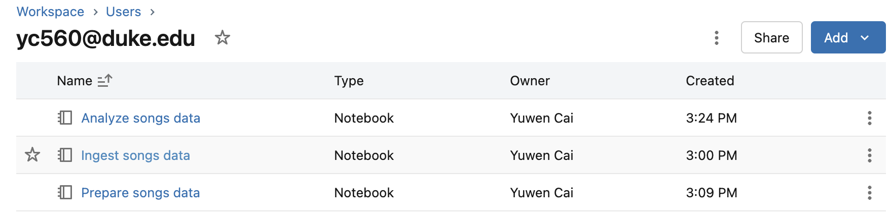
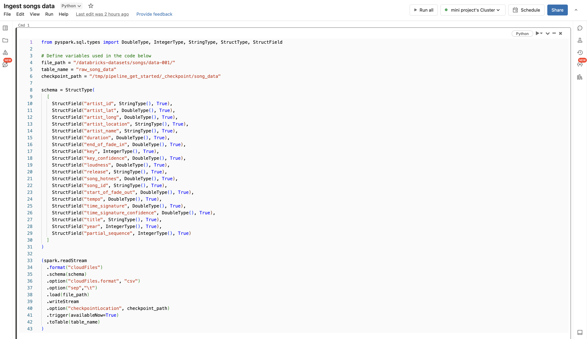
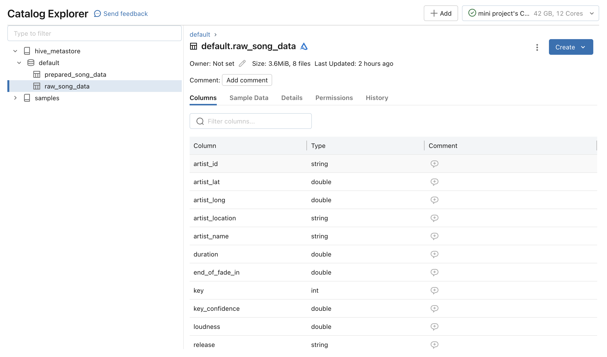
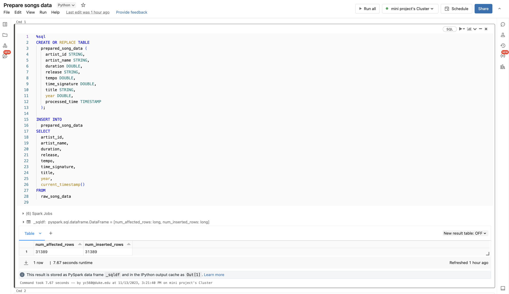
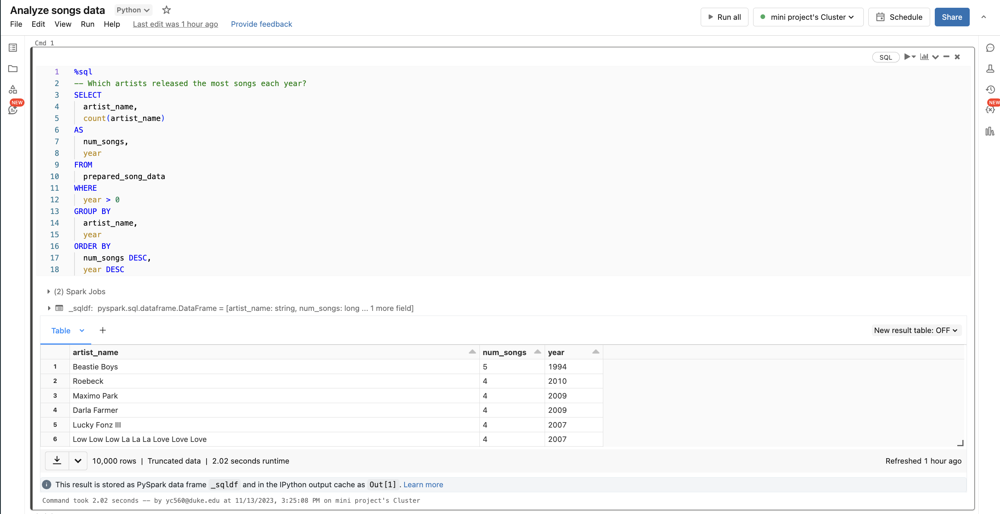
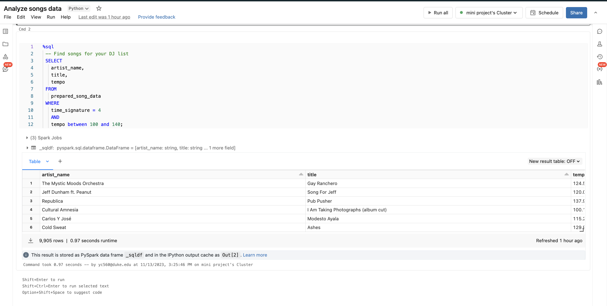
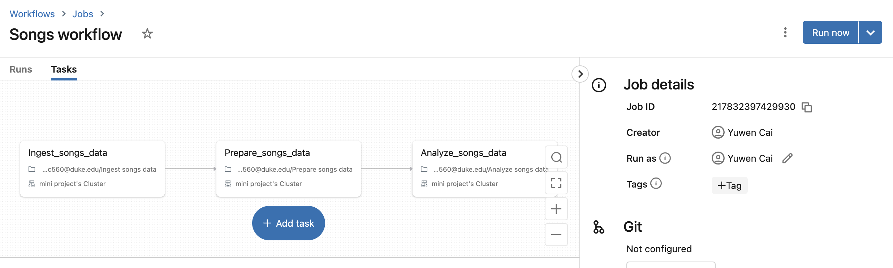
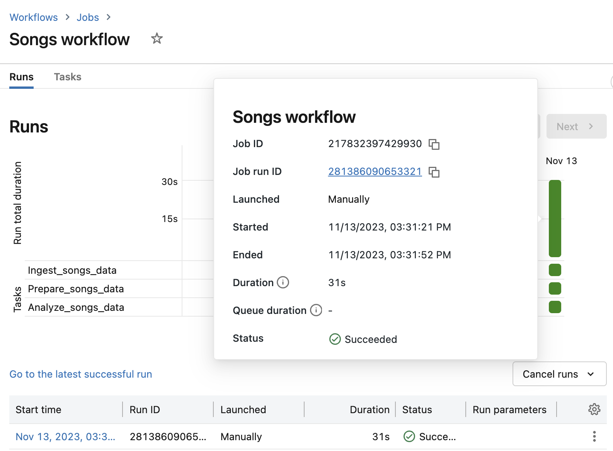
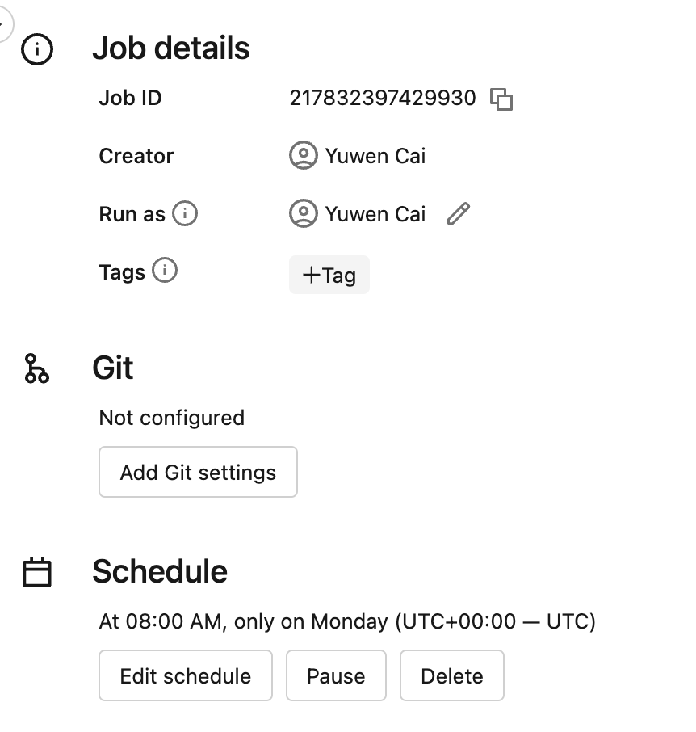

# IDS 706 Mini Project 11 -- Data Pipeline with Databricks

## Goal

Create a data pipeline using Databricks

Include at least one data source and one data sink

This repo is following the end-to-end tutorial by Databricks: https://docs.databricks.com/en/getting-started/data-pipeline-get-started.html

## Preparation

1. Azure Databricks
2. Create a self-defined cluster
3. Import Song Dataset
4. Perform data analysis in Databricks

## Run and Result

### Create three Databricks notebooks

### Ingest the raw data
> notebook

> table created

### Prepare the raw data

### Analyse the transformed data

> Which artists released the most songs each year?

> Find songs for your DJ list

### Create a Databricks job to run the pipeline

### Workflow
> Schedule the data pipeline job
> set as UTC+5 Evern Monday 08:00

